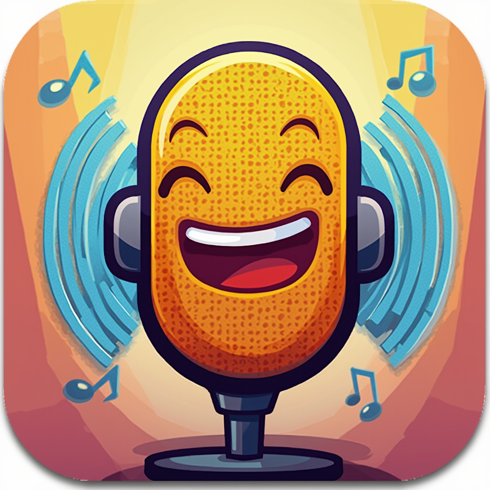
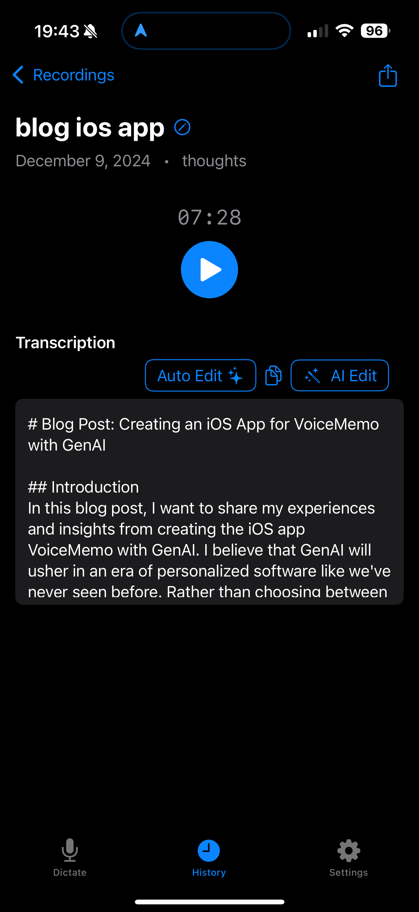
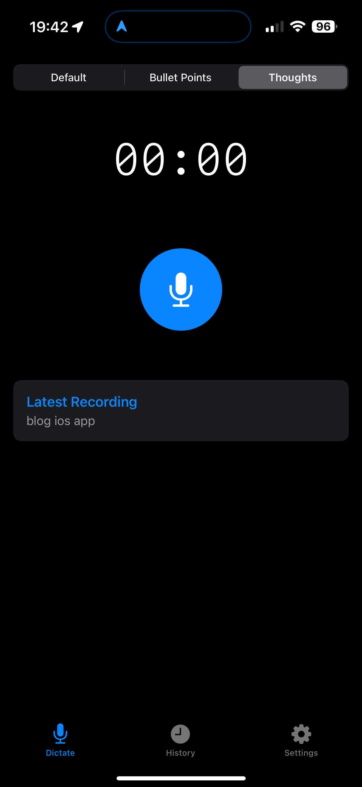

# MemSieve: Your AI Dictation Assistant

MemSieve is a simple yet powerful iOS dictation app that helps you capture, transcribe, and format your thoughts with ease. Record anywhere, even offline - transcribe when you're ready to connect.

## Features

- **Smart Presets**: Pre-configured templates that automatically clean up and transform your transcriptions:
  - **Default**: Simple transcription with your personal context
  - **Bullet Points**: Automatically formats text into organized bullet points
  - **Thoughts**: Structures recordings into clear sections with headings
- **Offline Recording**: Record anywhere, transcribe later when online
- **Customizable Context**: Personalize transcription prompts to improve accuracy for names, terms, and phrases you use often
- **Import Support**: Seamlessly import recordings from Apple Voice Memos
- **AI-Powered Editing**: Highlight any text and use AI to edit, reformat, or refine your transcriptions
- **Flexible Export**: Copy, paste, email, or share your transcriptions however you prefer

## Screenshots

 

## Technical Details

- Built for iOS using SwiftUI
- Uses AVFoundation for audio recording and processing
- Integrates with OpenAI's API for transcription (Whisper) and text editing (GPT-4o)
- Supports high-quality audio formats (192kbps AAC)
- Implements smart chunking for handling long recordings (silence detection based on power level)

## Requirements

- iOS 15.0 or later
- OpenAI API key for transcription services and text editing
- Internet connection for transcription (can be done later on)

## Getting Started

1. Clone the repository
2. Add your OpenAI API key to `Config.swift`
3. Build and run using Xcode
4. Grant microphone permissions when prompted

## Usage

1. Select a preset (Default, Bullet Points, or Thoughts)
2. Tap the microphone button to start recording
3. Monitor your audio levels in real-time
4. Tap the stop button when finished
5. Add a label to your recording
6. Wait for transcription and auto-formatting to complete
7. View and edit your transcribed text in the History tab